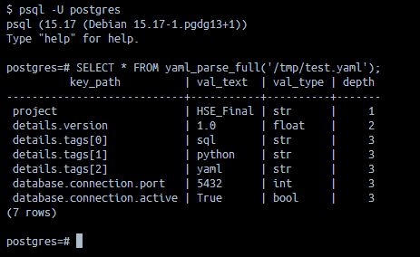
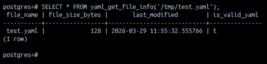
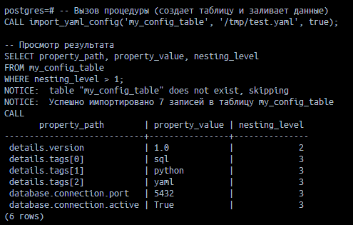
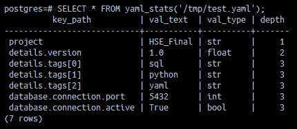
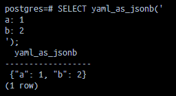

# pg_yaml_loader: YAML Data Integration Extension for PostgreSQL

## 1. Описание проекта
**pg_yaml_loader** - это расширение для СУБД PostgreSQL, предназначенное для реляционной обработки данных в формате YAML. В отличие от стандартных средств работы с JSON, данное расширение позволяет «разворачивать» древовидные структуры YAML любой вложенности в плоские наборы данных (SQL-сеты) прямо в процессе выполнения запроса.

### Ключевые возможности:
* **Рекурсивный парсинг**: Полная денормализация YAML-файлов (включая вложенные словари и массивы).
* **Метаданные**: Получение информации о файлах (размер, дата изменения, валидность).
* **Автоматизация**: Процедура для мгновенного импорта структуры YAML в постоянные таблицы БД.
* **Гибридный поиск**: Конвертация YAML в нативный тип `JSONB` для использования встроенных операторов поиска Postgres.

---

## 2. Техническая реализация (Математический метод)
В основе расширения лежит алгоритм **обхода дерева в глубину (Depth-First Search, DFS)**, реализованный на языке **PL/Python**.


Функция `flatten_node` рекурсивно обрабатывает узлы:
1.  **Dictionaries (Словари)**: Ключи объединяются через точку (напр., `database.port`).
2.  **Lists (Списки)**: Элементы нумеруются индексами (напр., `servers[0]`).
3.  **Scalars (Значения)**: При достижении конечного значения фиксируется путь, само значение, его тип данных и глубина вложенности.

---

## 3. Инструкция по развертыванию (Docker)

Проект настроен для работы в Docker-контейнере на базе **PostgreSQL 15** с предустановленным окружением **Python 3** и библиотекой **PyYAML**.

### Шаг 1: Сборка образа
```bash
docker build -t yaml_postgres_image .
```

### Шаг 2: Запуск контейнера
```bash
docker run --name hse_yaml_container \
  -e POSTGRES_PASSWORD=mysecret \
  -p 5433:5432 \
  -d yaml_postgres_image
```

### Шаг 3: Активация в БД
Подключитесь к базе (порт 5433) и выполните SQL:
```sql
CREATE EXTENSION plpython3u;
CREATE EXTENSION pg_yaml_loader;
```

---

## 4. Демонстрация и тесты

Для тестирования создайте файл внутри контейнера:
```bash
docker exec -it hse_yaml_container bash -c "echo '
project: HSE_Final
details:
  version: 1.0
  tags: [sql, python, yaml]
database:
  connection:
    port: 5432
    active: true' > /tmp/test.yaml"
```

### Тест №1: Полный парсинг структуры
Этот запрос демонстрирует работу алгоритма DFS и превращение дерева в строки.
```sql
SELECT * FROM yaml_parse_full('/tmp/test.yaml');
```



### Тест №2: Получение метаданных файла
Проверка системной информации о файле перед обработкой.
```sql
SELECT * FROM yaml_get_file_info('/tmp/test.yaml');
```



### Тест №3: Автоматизированный импорт
Создание таблицы и загрузка данных одной командой.
```sql
-- Вызов процедуры (создает таблицу и заливает данные)
CALL import_yaml_config('my_config_table', '/tmp/test.yaml', true);

-- Просмотр результата
SELECT property_path, property_value, nesting_level 
FROM my_config_table 
WHERE nesting_level > 1;
```



### Тест №4: Анализ типов данных 
Использование встроенного представления для статистики.

```sql
-- Предварительно убедитесь, что файл доступен по пути в view или создайте свой
SELECT * FROM yaml_stats('/tmp/test.yaml');
```



### Тест №5: YAML->jsonb 
Создание jsonb из yaml через функцию

```sql
SELECT yaml_as_jsonb('
a: 1
b: 2
');
```



